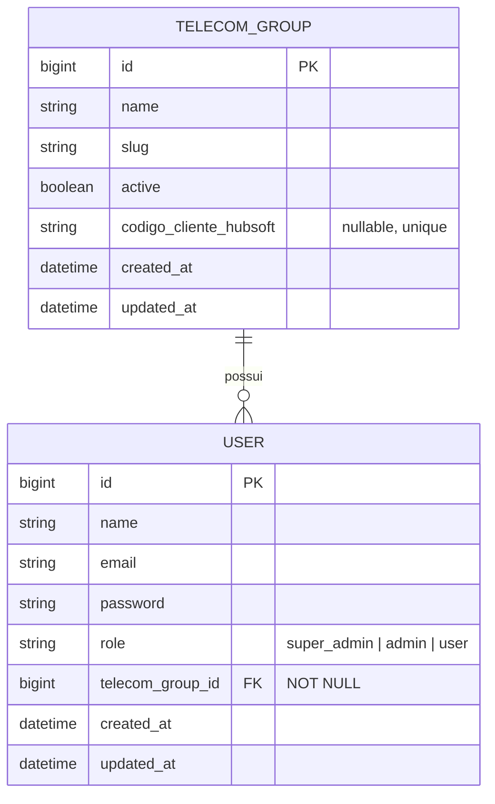

# Modelo de Dados: Gerenciamento de Usuários e Hubsoft

## Entidades e Relacionamentos

## Detalhes das Entidades

### 1. Entidade: `User` (Usuário)
Representa a conta do usuário no sistema.
- `id` (bigint, PK): Identificador único.
- `name` (string): Nome completo do usuário.
- `email` (string, unique): E-mail de login.
- `role` (string): Cargo de atuação. Os valores permitidos são:
  - `super_admin`: NOC / Kayros Link (Empresa Dona - vê tudo e gerencia tudo).
  - `admin`: Administrador da Telecom Parceira ou da Dona (gerencia apenas usuários do mesmo grupo).
  - `user`: Usuário padrão/operador da telecom.
- `telecom_group_id` (bigint, FK): Chave estrangeira ligando ao grupo de telecomunicações. Sempre obrigatório (`NOT NULL`), apontando para o grupo `owner` caso o usuário seja do NOC/staff interno da dona.

### 2. Entidade: `TelecomGroup` (Grupo Telecom / Empresa Parceira)
Representa a empresa de telecomunicação parceira integrada à rede neutra.
- `id` (bigint, PK): Identificador único.
- `name` (string): Nome da empresa parceira.
- `slug` (string, unique): Identificador amigável para URLs.
- `active` (boolean): Indica se a empresa parceira está ativa no sistema.
- `codigo_cliente_hubsoft` (string, unique, nullable): **[NOVO]** Código de integração identificador da empresa no ERP Hubsoft.

## Regras de Transição e Validação
- **Validação de Email**: O e-mail de um usuário deve ser exclusivo no banco de dados.
- **Validação de Senha**: Na criação de usuários, a senha é obrigatória e deve ter pelo menos 8 caracteres. Na atualização, se o campo for preenchido, deve seguir a regra de tamanho; se vazio, a senha não é alterada.
- **Grupo Telecom Obrigatório**: Todo usuário deve possuir um `telecom_group_id`. Se a operação for efetuada por um `super_admin`, ele deve selecionar o grupo. Se efetuada por um `admin`, o novo usuário herdará o mesmo ID do administrador. NOC/super_admins padrão pertencem ao grupo `owner`.
